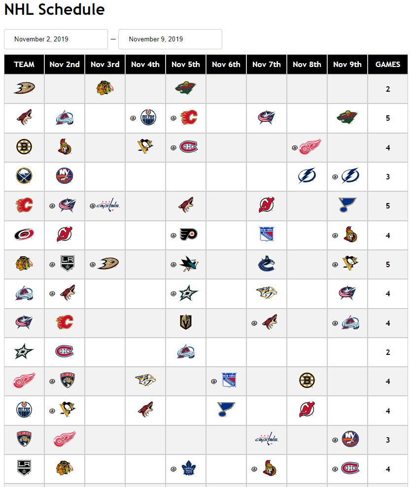

# nhl-schedule

Simple app for showing nhl schedule grid for given date range. Live [demo](https://jerkerb.github.io/nhl-schedule/).



## Getting Started

To run this project, install it locally with npm or yarn:
```
git clone git@github.com:JerkerB/nhl-schedule.git
yarn install
yarn start
```
To build for production use:
```
yarn build
```
